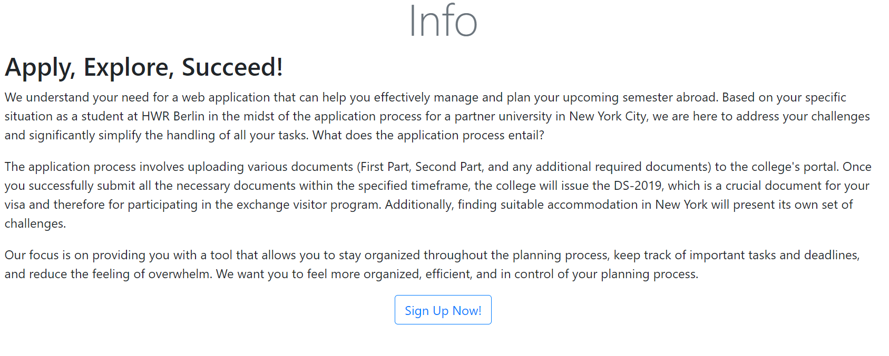

[Jane Dane]
{: .label }

# [API reference]
{: .no_toc }

  

    Table of contents
  

  {: .text-delta }
- TOC
{:toc}

## [Section / module]

### `function_definition()`

**Route:** `/route/`

**Methods:** `POST` `GET` `PATCH` `PUT` `DELETE`

**Purpose:** [Short explanation of what the function does and why]

**Sample output:**

[Show an image, string output, or similar illustration -- or write NONE if function generates no output]

---

## User login

### `login()`

**Route:** `/login`

**Methods:** `GET` `POST`

**Purpose:** Shows the login page, where the user is able to login into his account. 

**Sample output:**

---

## User logout 

### `logout()`

**Route:** `/logout`

**Methods:** None

**Purpose:** Logs the user out of his account and redirects to the home page.

**Sample output:**

Browser shows: `Homepage`

---

## User registration 

### `sign_up()`

**Route:** `/sign_up`

**Methods:** `GET` `POST`

**Purpose:** Shows the registration page. The user creates an  account with the email and the password and gets redirected to the Application Part 1 page.

**Sample output:**

---

## Homepage 

### `home()`

**Route:** `/`

**Methods:** `GET` `POST`

**Purpose:** Shows the homepage of the website. 

**Sample output:**

--- 

## Infopage 

### `infoPage()`

**Route:** `/infoPage`

**Methods:** `GET` `POST`

**Purpose:** Shows the Infopage of the website. 

**Sample output:**

---

## Application Part 1 or Application Part 2 or SubTask 

### `ApplicationPart1()`, `ApplicationPart2()`, `SubTask...()`

**Route:** `/ApplicationPart1`, `/ApplicationPart2`, `/SubTask...`

**Methods:** `GET` `POST` `DELETE`

**Purpose:** Shows the Application Part 1, Part 2 or Sub Task views of the website with the standardized tasks. 

**Sample output:**

---

## Save Date Part 1 or 2 

### `save_datePart1()` or `save_datePart2()`

**Route:** `/save-datePart1` or `/save-datePart2`

**Methods:** `POST`

**Purpose:** Adds a deadline to Part 1 or 2 of the application, that is saved in the database.  

**Sample output:**

Browser shows: `Application Part 1 or Part 2 with no deadline`

---

## Display Date Part 1 or 2 

### `displayDatePart1(date_id)` or `displayDatePart2(date_id)`

**Route:** `/displayDatePart1/<date_id>` or `/displayDatePart2/<date_id>`

**Methods:** `POST`

**Purpose:** Displays the deadline, that is saved in the database, to Part 1 or 2 of the application, that will be displayed under the header.  

**Sample output:**

---

## Delete Date Part 1 or 2 

### `delete_datePart1(date_id)` or `delete_datePart2(date_id)`

**Route:** `/deleteDatePart1/<date_id>` or `/deleteDatePart2/<date_id>`

**Methods:** `POST`

**Purpose:** Deletes the deadline from Part 1 or 2 of the application.  

**Sample output:**

Browser shows: `Application Part 1 or Part 2 without the date`

---

## Add Note Part 1 or 2 

### `add_notePart1()` or `add_notePart2()`

**Route:** `/addNotePart1` or `/addNotePart2`

**Methods:** `POST`

**Purpose:** Adds a note to Part 1 or 2 of the application. 

**Sample output:** Shows Application Part 1 or Part 2 with added note : 

---

## Delete Note Part 1 or 2 

### `delete_notePart1()` or `delete_notePart2()`

**Route:** `/delete-note/Part1/<note_id>` or `/delete-note/Part2/<note_id>`

**Methods:** `POST`

**Purpose:** Deletes a note from Part 1 or 2 of the application. 

**Sample output:**

Browser shows: `Application Part 1 or Part 2 without the added note.`

---

## Add Task Part 1 or Part 2 or Sub Tasks

### `add_TaskPart1()` or `add_TaskPart2()` or `add_TaskPersonalData()` or `add_TaskAcademicRessources()` or `add_TaskFinancialRessources()`

**Route:** `/addTaskPart1` or `/addTaskPart2` or `/addTaskPersonalData` or `addTaskAcademicRessources` or `/addTaskFinancialRessources`

**Methods:** `POST`

**Purpose:** Adds a new task to Part 1, Part 2 or one of the Sub Task Parts of the application. 

**Sample output:** Task has been to Application Part 1 or the other pages. 

---

## Complete Task Part 1 or Part 2 or Sub Tasks

### `complete_taskPart1(task_id)` or `complete_taskPart2(task_id)` or `complete_taskPersonalData(task_id)` or `complete_taskAcademicRessources(task_id)` or `complete_taskFinancialRessources(task_id)`

**Route:** `/completeTaskPart1/<task_id>` or `/complete_taskPart2<task_id>` or `/complete_taskPersonalData<task_id>` or `/complete_taskAcademicRessources<task_id>` or                              `/complete_taskFinancialRessources<task_id>`

**Methods:** `POST`

**Purpose:** Marks a task as done on Part 1, Part 2 or one of the Sub Task Parts of the application. 

**Sample output:**

---

## Delete Task Part 1 or Part 2 or Sub Tasks

### `delete_taskPart1(task_id)` or `delete_taskPart2(task_id)` or `delete_taskPersonalData(task_id)` or `delete_taskAcademicRessources(task_id)` or `delete_taskFinancialRessources(task_id)`

**Route:** `/deleteTaskPart1/<task_id>` or `/delete_taskPart2<task_id>` or `/delete_taskPersonalData<task_id>` or  `/delete_taskAcademicRessources<task_id>` or
`/delete_taskFinancialRessources<task_id>`

**Methods:** None

**Purpose:** Deletes a task from Part 1, Part 2 or one of the Sub Task Parts of the application. 

**Sample output:**

Browser shows: `Application Part 1 or another page, where the task has been deleted from.`
