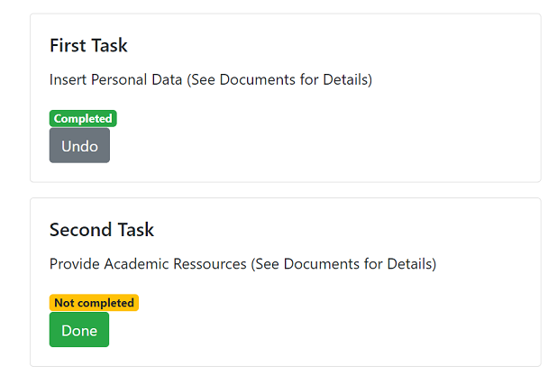

Lasse Schmidt
{: .label }

# API reference
{: .no_toc }

  

    Table of contents
  

  {: .text-delta }
- TOC
{:toc}

---

## User login

### `login()`

**Route:** `/login`

**Methods:** `GET` `POST`

**Purpose:** Shows the login page, where the user is able to login into his account. 

**Sample output:**

---

## User logout 

### `logout()`

**Route:** `/logout`

**Methods:** None

**Purpose:** Logs the user out of his account and redirects to the home page.

**Sample output:**

Browser shows: `Homepage`

---

## User registration 

### `sign_up()`

**Route:** `/sign_up`

**Methods:** `GET` `POST`

**Purpose:** Shows the registration page. The user creates an  account with the email and the password and gets redirected to the Application Part 1 page.

**Sample output:**

---

## Homepage 

### `home()`

**Route:** `/`

**Methods:** `GET` `POST`

**Purpose:** Shows the homepage of the website. 

**Sample output:**

--- 

## Infopage 

### `infoPage()`

**Route:** `/infoPage`

**Methods:** `GET` `POST`

**Purpose:** Shows the Infopage of the website. 

**Sample output:**

---

## Application Part 1 or Application Part 2 or SubTask 

### `ApplicationPart1()`, `ApplicationPart2()`, `SubTask...()`

**Route:** `/ApplicationPart1`, `/ApplicationPart2`, `/SubTask...`

**Methods:** `GET` `POST` `DELETE`

**Purpose:** Shows the Application Part 1, Part 2 or Sub Task views of the website with the standardized tasks. 

**Sample output:**

---

## Save Date Part 1 or 2 

### `save_date(page_name)`

**Route:** `/saveDate/<page_name>`

**Methods:** `POST`

**Purpose:** Adds a deadline to Part 1 or 2 of the application, that is saved in the database.  

**Sample output:** 

---

## Delete Date Part 1 or 2 

### `delete_date(page_name,date_id)`

**Route:** `/deleteDate/<page_name>/<date_id>`

**Methods:** `POST`

**Purpose:** Deletes the deadline from Part 1 or 2 of the application.  

**Sample output:**

Browser shows: `Application Part 1 or Part 2 without the date`

---

## Add Note Part 1 or 2 

### `add_note(page_name)`

**Route:** `/addNote/<page_name>`

**Methods:** `POST`

**Purpose:** Adds a note to Part 1 or 2 of the application. 

**Sample output:** Shows Application Part 1 or Part 2 with added note : 

---

## Delete Note Part 1 or 2 

### `delete_note(page_name)`

**Route:** `/deleteNote/<page_name>/<note_id>`

**Methods:** `POST`

**Purpose:** Deletes a note from Part 1 or 2 of the application. 

**Sample output:**

Browser shows: `Application Part 1 or Part 2 without the added note.`

---

## Add Personal Task Part 1 or Part 2

### `addPersonalTask(page_name)`

**Route:** `/addPersonalTask`

**Methods:** `POST`

**Purpose:** Adds a new Personal Task to Part 1 or Part 2 of the application. (Depending on where the user is adding it.)

**Sample output:** Task has been added to Application Part 1 or Application Part 2: 

---

## Add Personal Sub Task

### `addPersonalSubTask(page_name)`

**Route:** `/addPersonalSubTask`

**Methods:** `POST`

**Purpose:** Adds a new Personal Task to the Sub Tasks Personal Data, Academic Ressources or Financial Ressources of the application. (Depending on where the user is adding it.)

**Sample output:** Task has been added to Personal Data, Academic Ressources or Financial Ressources:  

---

## Complete Task Part 1 or Part 2

### `complete_task(page_name,task_id)`

**Route:** `/completeTask/<page_name>/<task_id>`

**Methods:** `POST`

**Purpose:** Marks a task as done on Part 1, Part 2 of the application. 

**Sample output:**

---

## Complete Sub Task

### `complete_subTask(page_name,task_id)`

**Route:** `/completeSubTask/<page_name>/<task_id>`

**Methods:** `POST`

**Purpose:** Marks a task as done on the Sub Tasks Personal Data, Academic Ressources or Financial Ressources of the application.

**Sample output:**

---

## Delete Task Part 1 or Part 2

### `delete_task(page_name,task_id)`

**Route:** `/deleteTask/<page_name>/<task_id>`

**Methods:** None

**Purpose:** Deletes a task from Part 1, Part 2 of the application. 

**Sample output:**

Browser shows: `Application Part 1 or another page, where the task has been deleted from.`

## Delete Sub Task 

### `delete_subTask(page_name,task_id)`

**Route:** `/deleteSubTask/<page_name>/<task_id>`

**Methods:** None

**Purpose:** Deletes a task from Sub Tasks Personal Data, Academic Ressources or Financial Ressources of the application.

**Sample output:**

Browser shows: `shows Sub Tasks Personal Data, Academic Ressources or Financial Ressources, where the task has been deleted from.`
