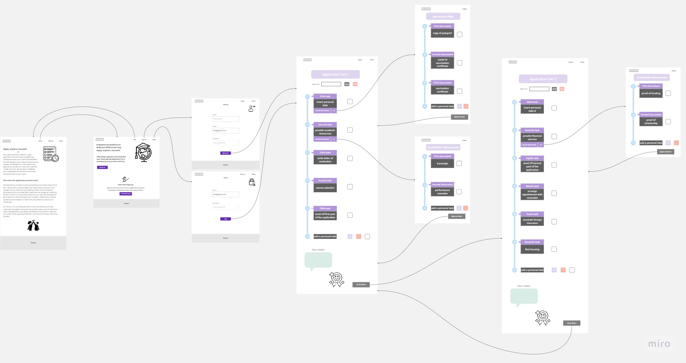

Lasse Schmidt und Isabel Kaspar
{: .label }

# App behavior
{: .no_toc }

  

    Table of contents
  

  {: .text-delta }
- TOC
{:toc}

---

### Unser Mock Up

### Link zu unserem Miro-Board

https://miro.com/app/board/uXjVM-pFY7o=/?share_link_id=52814562512

### Detaillierte Erläuterung der Anwendung

Der Benutzer landet auf der Homepage. Von dort aus hat er die Möglichkeit, entweder zur Infopage, zum Login oder zur Registrierung zu gehen. Auf der Infopage kann er sich über die Website informieren und entscheiden, ob er sich registrieren oder einloggen möchte. Bei der Registrierung kann er einen Account mit Namen, E-Mail und Passwort erstellen und wird zur Application Part One Seite weitergeleitet. Entscheidet sich der Benutzer für den Login, kann er sich dort mit E-Mail und Passwort anmelden und wird ebenfalls zur Application Part One weitergeleitet. Auf der Application Part One Seite hat der Benutzer verschiedene Möglichkeiten:

-	eine Deadline hinzufügen 
-	eine Deadline löschen
-	einen Task als erledigt markieren oder wieder als nicht erledigt markieren 
-	auf die Subtasks (z. B. Personal Data) klicken und zu einer neuen Seite mit den benötigten Dokumenten und Aufgaben für den bestimmten Task gelangen 
-	einen weiteren individuellen Task zur standardisierten Liste hinzufügen 
-	einen selbst hinzugefügten Task wieder löschen
-	eine Notiz hinzufügen 
-	eine Notiz löschen

Schließlich kann der Benutzer auf einen Button klicken, um zur zweiten Seite, Application Part Two, zu gelangen. Auf dieser Seite sieht er weitere Tasks, die er zu erledigen hat, und es gibt genau die gleichen Funktionalitäten wie auf der ersten Seite.

Für die Subtasks stehen nicht alle Möglichkeiten wie bei Part One oder Part Two zur Verfügung. Der Benutzer kann hier lediglich..:

- einen Task als erledigt markieren oder wieder als nicht erledigt markieren
- zurück auf Part One bzw. Part Two gelangen (über die Navigationsleiste)
- einen weiteren individuellen Task zur standardisierten Liste hinzufügen 
- einen selbst hinzugefügten Task wieder löschen

