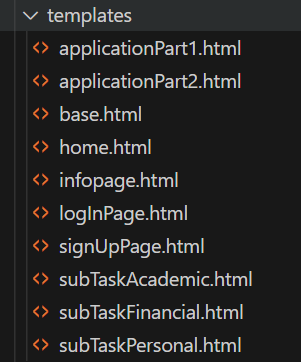

Lasse Schmidt und Isabel Kaspar
{: .label }

# App structure, incl. context

{: .no_toc }

  

    Table of contents
  

  {: .text-delta }
- TOC
{:toc}

---

### Klassendiagramm zur Veranschaulichung der Struktur unserer Anwendung

### Link zu Lucid Chart: 
https://lucid.app/lucidchart/06b31ea1-8d28-4c47-92c7-21bac93f265a/edit?viewport_loc=141%2C2465%2C3044%2C1135%2C0_0&invitationId=inv_1b263f21-f592-4aff-b86a-d6a828bdaa6b

Unser Klassendiagramm richtet sich nach der MVC-Struktur. Daran haben wir uns auch bei dem Programmieren unserer Anwendung gehalten. 

### View

In der View gibt es Base, Homepage, Infopage, SignUpPage, LoginPage, ApplicationPartX und die ApplicationSubTask Views. Diese sind in unserer Projektstruktur als HTML-Dateien unter templates  wiederzufinden: 

### Controller

Im Controller sind die definierten Routes zu den gegebenen Views zu finden. Es gibt Routes für Home, Info, SignUp, Login, Logout, ApplicationPartOne, ApplicationPartTwo, SubTaskPersonalData, SubTaskAcademicRessources und SubtaskFinancialRessources. Diese Routes sind in den beiden Klassen views.py und auth.py zu finden. In auth.py befinden sich die Routes für die Authentifizierung des Benutzers, ergo SignUp, Login und Logout. Der Rest liegt in views.py. 

### Model

Zuletzt gibt es noch das Datenmodell. Bei dem Modell haben wir die Tabellen User, Date, Note und Task erstellt. Diese sind zu finden in models.py: 

Und sehen wie folgt aus: 

Dadurch, dass wir die MVC-Struktur nutzen, generieren wir eine klare Unterteilung für unsere Webapplikation. Der Vorteil ist, dass wir genau wissen, wo wir neue Funktionalitäten einfügen und wie wir diese in unsere App integrieren müssen.

### Quellen:
Eck, A. (2023). Full-Stack Web Dev @ HWR Berlin. HWR Berlin. https://hwrberlin.github.io/fswd/01-python-vscode.html#2-install-visual-studio-code-and-prepare-your-workspace (zuletzt geprüft am 28.07.2023).

