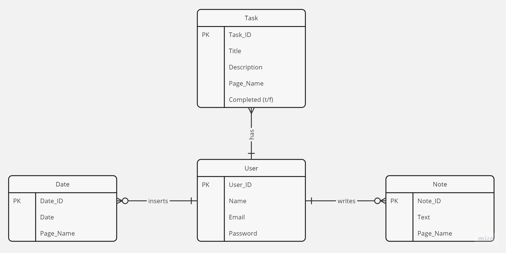

Lasse Schmidt und Isabel Kaspar
{: .label }

# Data model

Entitäten und Attribute: 

User: 
-	User ID (Primary Key) 
-	Name 
-	Email 
-	Password 

Date: 
-	Date ID (Primary Key) 
-	Date (gespeichert als String) 
-	Page Name 

Note: 
-	Note ID (Primary Key) 
-	Text 
-	Page Name 

Task: 
-	Task ID (Primary Key) 
-	Title 
-   Description 
-	Page 
-	Name 
-	Completed (boolean-Attribut) 

Beziehungen/Kardinalitäten: 
-	Der User kann 0 bis 2 Dates einfügen, und jedes Date ist genau einem User zugewiesen. 
-	Der User kann beliebig viele Tasks haben, und jeder Task ist genau einem User zugewiesen. 
-	Der User kann 0 oder mehr Notizen schreiben, und jede Notiz ist genau einem User zugewiesen.

Durch dieses Datenmodell wird deutlich, dass jeder Benutzer seine eigenen Datums, Notizen und Aufgaben hat, die ihm eindeutig zugeordnet sind. Die Verwendung von Primärschlüsseln (User ID, Date ID, Note ID, Task ID) ermöglicht eine eindeutige Identifizierung jeder Entität. Task, Date und Note haben die User ID als Fremdschlüssel. Die Beziehungen zwischen den Entitäten sind somit gut definiert, was die Datenintegrität und Konsistenz gewährleistet.
